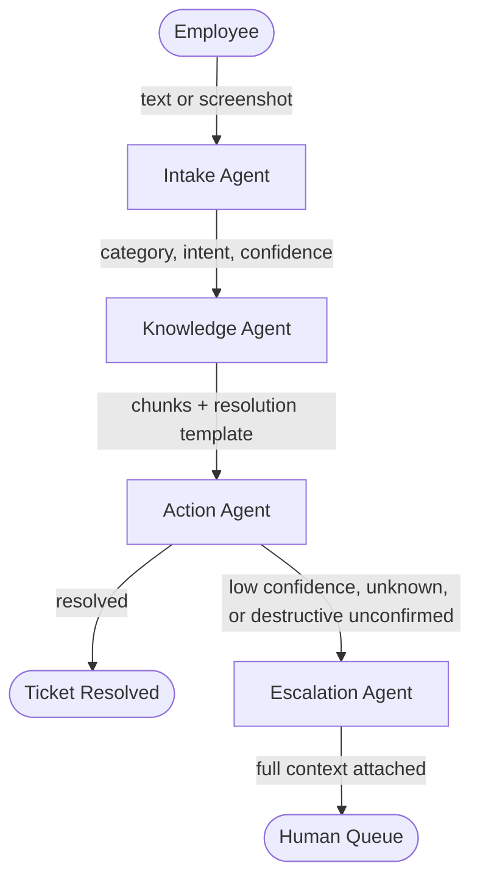

# NeuraDesk

**Production-grade agentic IT/HR service platform — multi-agent AI that autonomously resolves enterprise tickets**

[](https://python.org)
[](LICENSE)
[](tests/)

## Demo

> Demo video coming — Week 4

---

## What It Does

Enterprise IT/HR teams spend 60–80% of their time on repetitive tickets — password resets, access provisioning, leave approvals, incident creation — that follow predictable patterns. The bottleneck is not intelligence; it is routing, context retrieval, and safe execution at scale.

NeuraDesk routes every incoming ticket through four specialized LangGraph agents: an Intake Agent that classifies intent with a DSPy-optimized classifier, a Knowledge Agent that retrieves relevant articles via hybrid FAISS + BM25 retrieval with cross-encoder reranking, an Action Agent that executes enterprise API calls behind an explicit confirmation gate for destructive operations, and an Escalation Agent that hands off unresolved tickets with full state attached.

## Architecture



| Agent | Role |
|---|---|
| **Intake** | DSPy-optimized classifier — assigns category, intent, priority, and confidence score |
| **Knowledge** | Hybrid retrieval: FAISS semantic search + BM25 lexical search + cross-encoder reranking |
| **Action** | Executes ITSM/HR API calls; blocks destructive operations until explicitly confirmed |
| **Escalation** | Routes to the correct support tier with complete agent context attached |

## Stack

| Layer | Technology |
|---|---|
| Orchestration | LangGraph 0.2, typed `TicketState` |
| RAG | FAISS + rank-bm25 + sentence-transformers cross-encoder |
| Prompt optimization | DSPy 2.5 |
| LLM | Claude 3.5 Sonnet via langchain-anthropic |
| Tracing | LangSmith — every node is a named span |
| API | FastAPI 0.115, WebSocket streaming, structlog |
| Auth | JWT (PyJWT) + bcrypt, 8-hour sessions |
| Database | PostgreSQL, SQLAlchemy 2.0 `mapped_column` |
| Cloud | GCP Cloud Run, Docker, docker-compose |
| Testing | pytest, RAGAS evaluation suite |

## Key Features

- ✅ Multi-agent orchestration with LangGraph — 4 nodes, typed `TicketState`, conditional routing
- ✅ Hybrid RAG — FAISS semantic + BM25 lexical + cross-encoder reranking
- ✅ DSPy-optimized ticket classifier with offline prompt compilation
- ✅ Multimodal input — plain text and base-64 encoded screenshots
- ✅ A2A protocol endpoint on the Knowledge Agent (agent-to-agent interop)
- ✅ Production safety — explicit confirmation gate blocks all destructive API calls
- ✅ Auto-escalation with complete agent state forwarded to the human queue
- ✅ LangSmith tracing on every node — no silent agent execution
- ✅ JWT auth, JSON-lines audit log (SHA-256 token hash, latency), structured errors
- ✅ RAGAS evaluation suite with CI enforcement on faithfulness and answer relevance

## Quickstart

**Prerequisites:** Python 3.11, Docker (for Postgres — optional, SQLite works locally)

```bash
git clone https://github.com/Subh24ai/neuradesk.git
cd neuradesk

python3.11 -m venv .venv && source .venv/bin/activate
pip install --upgrade pip && pip install -e ".[dev]"

cp .env.example .env
# Fill in: ANTHROPIC_API_KEY, ENTERPRISE_API_SECRET, API_SECRET_KEY
```

**Full stack with Docker (recommended):**
```bash
docker-compose up --build
# Backend → localhost:8000   Enterprise mock API → localhost:8001
```

**Local dev without Docker (SQLite fallback):**
```bash
uvicorn api.main:app --reload          # DATABASE_URL defaults to sqlite:///./neuradesk.db
```

**Submit your first ticket:**
```bash
TOKEN=$(curl -s -X POST http://localhost:8000/auth/register \
  -H "Content-Type: application/json" \
  -d '{"email": "you@company.com", "password": "testpass123"}' | jq -r .access_token)

curl -s -X POST http://localhost:8000/tickets \
  -H "Authorization: Bearer $TOKEN" \
  -H "Content-Type: application/json" \
  -d '{"text": "I forgot my password"}' | jq .
```

**Run tests:**
```bash
pytest tests/ -v          # 33 tests, ~2.5 s
```

## Project Structure

```
neuradesk/
├── agents/              # LangGraph nodes and typed TicketState
│   ├── state.py         # Single TypedDict threaded through every node
│   ├── graph.py         # Wiring, conditional routing, run_ticket() entry point
│   ├── intake_node.py   # Category · intent · priority · confidence
│   ├── knowledge_node.py# FAISS + BM25 retrieval (Week 2)
│   ├── action_node.py   # Enterprise API dispatch + destructive-action gate
│   └── escalation_node.py # Human handoff with full state
├── api/                 # FastAPI app — auth, ticket routes, WebSocket stream
├── services/            # Mock ITSM/HR endpoints + async JSON-lines audit log
├── rag/                 # Retriever (Week 2)
├── dspy_modules/        # DSPy signatures and compiled classifiers (Week 2)
├── tracing/             # LangSmith singleton client and per-node span helper
├── tests/               # pytest suite — graph logic, API routes, enterprise API
├── infra/               # Dockerfile, GCP Cloud Run config
└── docker-compose.yml   # PostgreSQL · backend · enterprise mock API
```

## API Reference

### Main API — port 8000

| Method | Endpoint | Auth | Description |
|---|---|---|---|
| `POST` | `/auth/register` | — | Create account, returns 8-hour JWT |
| `POST` | `/auth/login` | — | Login, returns 8-hour JWT |
| `POST` | `/tickets` | JWT | Run agent graph, persist and return result |
| `GET` | `/tickets/` | JWT | Last 20 tickets for the authenticated user |
| `GET` | `/tickets/{id}` | JWT | Full ticket state by ID |
| `WS` | `/ws/{ticket_id}` | — | Stream per-node status events in real time |

### Enterprise Mock API — port 8001

All endpoints require `Authorization: Bearer <ENTERPRISE_API_SECRET>` and append to `services/audit.jsonl`.

| Method | Endpoint | Destructive | Description |
|---|---|---|---|
| `POST` | `/itsm/reset-password` | ✅ | Generate temporary password |
| `POST` | `/itsm/provision-access` | ✅ | Grant resource role |
| `POST` | `/hr/approve-leave` | — | Approve leave request |
| `POST` | `/itsm/create-incident` | — | Open incident record |
| `POST` | `/itsm/notify-manager` | — | Email reporting manager |

## Benchmarks

| Metric | Value |
|---|---|
| Ticket resolution latency (P50) | — (Week 4) |
| Ticket resolution latency (P95) | — (Week 4) |
| RAG faithfulness score (RAGAS)        | 1.000 (5-question eval, Groq judge) |
| RAG answer relevancy (RAGAS)          | 0.633 (5-question eval, Groq judge) |
| DSPy classifier accuracy — zero-shot  | 66.7% (10/15) |
| DSPy classifier accuracy — compiled   | 93.3% (14/15) |
| Concurrent users tested | — (Week 4) |

## Roadmap

- ✅ **Week 1** — Core scaffold: LangGraph skeleton, FastAPI, JWT auth, mock enterprise API, 33 passing tests
- ✅ **Week 2** — RAG (faithfulness 1.0) ✓, DSPy 93.3% ✓, all agents live ✓ — 80 tests green
- ⬜ **Week 3** — A2A protocol, LangSmith tracing depth, CI/CD on GCP Cloud Run
- ⬜ **Week 4** — React frontend, load testing, RAGAS benchmarks, production deployment

---

Built by [Subhash Gupta](https://linkedin.com/in/subhashgupta) · [GitHub](https://github.com/Subh24ai/neuradesk)
